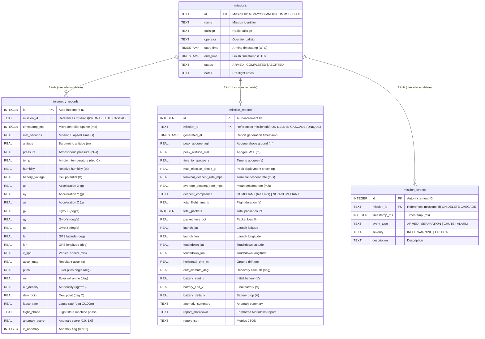

# Backend Services & Telemetry Processing Engines

This directory contains the Python backend services, asynchronous hardware serial dispatchers, mathematical signal processing engines, persistent SQLite flight database, and REST/WebSocket API endpoints.

## Architecture & Components

* **`app.py`**: FastAPI application exposing REST analytics endpoints, full-duplex WebSocket telemetry streams, ML inference pipelines, static report mounts, and web page routers:
  * **Web Page Routes**:
    * `GET /` or `GET /index.html`: Mission overview, interactive 3D PLA airframe, and hardware specs.
    * `GET /dashboard.html`: Real-time aerospace telemetry HUD, 3D attitude, and Web Serial bridge.
    * `GET /tinyml.html`: TinyML edge vision deep dive, INT8 quantization benchmarks, and inference simulator.
    * `GET /models.html`: 6-model machine learning architecture and comparative benchmark analysis.
    * `GET /analysis.html`: Post-flight mission analytics, interactive telemetry charts, sensor ablation suite, and dropout simulator.
    * `GET /results.html`: Flight testing research viewer and scenario comparison charts.
  * **REST Analytics & Telemetry Endpoints**:
    * `POST /analytics/kinematics`: 1D Kalman filter state estimation ($z, v_z$) and 6-DOF attitude calculation.
    * `POST /analytics/sounding`: Hypsometric altimetry, Magnus-Tetens dew point, air density, and environmental lapse rate.
    * `GET /hardware/ports`: Active USB serial COM port auto-detection.
    * `POST /hardware/tare`: 1-click sensor calibration and static gyro drift nulling.
    * `POST /api/predict`: Tabular ML inference (Random Forest phase classifier & Isolation Forest anomaly detector).
  * **Post-Flight Analysis & Ablation Endpoints**:
    * `GET /api/analysis/scenarios`: Enumeration of all 10 flight mission profiles with flight metadata.
    * `GET /api/analysis/scenario/{scenario_name}`: Full RFC 4180 telemetry CSV dataset for the requested scenario.
    * `GET /api/analysis/ablation-data`: Pre-computed multi-sensor ablation benchmarks across all 10 profiles and 4 sensor configurations (`ml/ablation_benchmarks.json`).
    * `POST /api/analysis/run-ablation`: Live sensor ablation trial execution evaluating custom dropped sensor subsets on flight datasets.
    * `GET /api/analysis/reports-zip`: In-memory ZIP archive packaging all 10 mission flight PDF reports and `reports/all_missions_summary.csv`.
  * **Flight Database (SQLite WAL) & Post-Flight Review (PFR) Persistence Endpoints**:
    * `POST /api/db/missions/start`: Arm and initialize a new flight mission session in SQLite (`data/cansat_missions.db`).
    * `POST /api/db/missions/telemetry`: High-frequency batch packet streaming (up to 500 pkts/batch).
    * `POST /api/db/missions/{mission_id}/events`: Record discrete flight events (stage separation, parachute deployment, alarms).
    * `POST /api/db/missions/{mission_id}/finish`: Seal flight, compute kinematic KPIs, and generate automated PFR audit report.
    * `GET /api/db/missions`: List all archived missions with status, duration, apogee, and packet count.
    * `GET /api/db/missions/{mission_id}`: Retrieve detailed mission metadata.
    * `GET /api/db/missions/{mission_id}/report`: Retrieve the stored Post-Flight Review audit report.
    * `GET /api/db/missions/{mission_id}/telemetry`: Fetch full historical telemetry records for replay and analysis.
    * `GET /api/db/stats`: Storage diagnostics returning database file size, WAL size, total missions, total packets, events, reports, and journal mode.
    * `GET /api/db/download`: Direct binary stream download of `data/cansat_missions.db` with prior WAL checkpointing for external inspection.
    * `GET /api/db/missions/{mission_id}/export/csv`: Export full 25-column mission flight telemetry in standard CanSat CSV format.
    * `DELETE /api/db/missions`: Complete cascaded wipe and purge of all stored flight sessions and sequence tables.
    * `DELETE /api/db/missions/{mission_id}`: Cascade deletion of a specific mission and all its telemetry, events, and reports.
  * **WebSocket Telemetry Streams**:
    * `/ws/serial`: Real-time dual-port serial bridge dispatcher (LoRa telemetry & video frame chunks).
    * `/ws/telemetry`: Simulated telemetry broadcast stream for replay and headless testing.
  * **Static File Mounts**:
    * `/reports`: Serves generated flight report PDFs (`reports/pdf/`) and high-resolution figures (`reports/figures/`).
* **`core/`**: Core mathematical, database, and serial abstraction engines:
  * **`database.py`**: SQLite persistent database engine operating in Write-Ahead Logging (WAL) mode with foreign keys. Manages 4 relational tables (`missions`, `telemetry_records`, `mission_reports`, `mission_events`), batch ingestion, PFR audit metrics computation, storage statistics diagnostics, full database purge, and 25-column CSV telemetry export.
  * **`serial_manager.py`**: `DualSerialManager` handling multi-port asynchronous hardware polling (COM4/COM3 LoRa @ 9600 baud and COM5 Video @ 460800 baud).
  * **`kinematics.py`**: `KinematicsEngine` providing 1D Kalman Filter state estimation ($z, v_z$), 6-DOF complementary attitude fusion, and high-G / tumble alarm triggers.
  * **`atmospheric.py`**: `AtmosphericEngine` providing hypsometric altimetry, Magnus-Tetens dew point, dry/moist air density, and Environmental Lapse Rate (ELR).
* **`standalone_server.ps1`**: Zero-dependency native Windows HTTP server utilizing .NET `HttpListener` for running the ground station on systems without Python.

## Flight Database Architecture & Relational Schema

The SQLite persistence engine operates in **Write-Ahead Logging (WAL)** mode at `data/cansat_missions.db`. It provides lock-free concurrent reads and writes, high-throughput micro-batched telemetry ingestion, discrete operational event logging, automated Post-Flight Review (PFR) regulatory audit reports, and full cascading deletions.

### Concurrency & Engine Guarantees
- **Write-Ahead Logging (WAL)**: `PRAGMA journal_mode=WAL;` allows read queries (e.g. Ground Station HUD, telemetry charting, PFR browser) to execute concurrently with incoming high-frequency telemetry writes without locking the database.
- **Normal Synchronization**: `PRAGMA synchronous=NORMAL;` guarantees zero corruption across power loss while eliminating disk I/O bottlenecks.
- **Foreign Key Cascades**: `PRAGMA foreign_keys=ON;` with `ON DELETE CASCADE` on all child tables (`telemetry_records`, `mission_reports`, `mission_events`), ensuring clean single-command deletion without orphaned records.
- **Collision-Proof Primary Keys**: Mission IDs are generated as `MSN-YYYYMMDD-HHMMSS-XXXX` (16-char ISO timestamp + 4-hex random entropy suffix), preventing primary key collisions during rapid testing.
- **Connection Safety**: Managed via Python's `@contextmanager get_db_connection()`, guaranteeing explicit closure and zero file handle leaks on Windows.

### Entity-Relationship Diagram



### 4-Table Relational Schema

#### 1. `missions` (Master Flight Header)
- `id` (`TEXT PRIMARY KEY`): `MSN-YYYYMMDD-HHMMSS-XXXX`
- `name` (`TEXT NOT NULL`): Human-readable mission name
- `callsign` (`TEXT NOT NULL DEFAULT 'CANSAT-1'`): Radio callsign
- `operator` (`TEXT NOT NULL DEFAULT 'Flight Controller'`): Ground operator name
- `start_time` (`TIMESTAMP DEFAULT CURRENT_TIMESTAMP`): Arming timestamp (UTC)
- `end_time` (`TIMESTAMP`): Finish timestamp (UTC)
- `status` (`TEXT NOT NULL DEFAULT 'ARMED'`): State (`ARMED`, `ACTIVE`, `COMPLETED`, `ABORTED`)
- `notes` (`TEXT`): Pre-flight notes and parameters

#### 2. `telemetry_records` (High-Rate Time-Series Records)
- `id` (`INTEGER PRIMARY KEY AUTOINCREMENT`): Unique packet ID
- `mission_id` (`TEXT NOT NULL, FK -> missions(id) ON DELETE CASCADE`): Mission association
- `timestamp_ms` (`INTEGER NOT NULL`): Microcontroller uptime in milliseconds
- `met_seconds` (`REAL NOT NULL`): Mission Elapsed Time ($T+$ seconds)
- `altitude` (`REAL NOT NULL`): Barometric altitude ($m$)
- `pressure` (`REAL NOT NULL`): Barometric pressure ($hPa$)
- `temp` (`REAL NOT NULL`): Ambient temperature ($^\circ C$)
- `humidity` (`REAL NOT NULL`): Relative humidity ($\%$)
- `battery_voltage` (`REAL NOT NULL`): LiPo battery voltage ($V$)
- `ax`, `ay`, `az` (`REAL NOT NULL`): Linear acceleration ($g$)
- `gx`, `gy`, `gz` (`REAL NOT NULL`): Gyroscopic angular rates ($^\circ/s$)
- `lat`, `lon` (`REAL NOT NULL`): GNSS coordinates (WGS84 decimal degrees)
- `v_spd` (`REAL NOT NULL DEFAULT 0.0`): Derived vertical velocity ($m/s$)
- `accel_mag` (`REAL NOT NULL DEFAULT 1.0`): Resultant acceleration magnitude ($g$)
- `pitch` (`REAL NOT NULL DEFAULT 0.0`): Euler pitch attitude angle ($^\circ$)
- `roll` (`REAL NOT NULL DEFAULT 0.0`): Euler roll attitude angle ($^\circ$)
- `air_density` (`REAL NOT NULL DEFAULT 1.225`): Dry air density ($kg/m^3$)
- `dew_point` (`REAL NOT NULL DEFAULT 15.0`): Magnus-Tetens dew point ($^\circ C$)
- `lapse_rate` (`REAL NOT NULL DEFAULT 0.65`): Environmental lapse rate ($^\circ C/100m$)
- `flight_phase` (`TEXT NOT NULL DEFAULT 'PAD_IDLE'`): ML flight phase classification
- `anomaly_score` (`REAL NOT NULL DEFAULT 0.0`): Isolation Forest anomaly score ($0.0 - 1.0$)
- `is_anomaly` (`INTEGER NOT NULL DEFAULT 0`): Binary anomaly flag
- **Indexes**:
  - `idx_telemetry_mission_met ON telemetry_records(mission_id, met_seconds)`
  - `idx_telemetry_timestamp ON telemetry_records(mission_id, timestamp_ms)`

#### 3. `mission_reports` (Post-Flight Review / PFR Regulatory Audits)
- `id` (`INTEGER PRIMARY KEY AUTOINCREMENT`): Unique report ID
- `mission_id` (`TEXT NOT NULL UNIQUE, FK -> missions(id) ON DELETE CASCADE`): 1-to-1 mission link
- `generated_at` (`TIMESTAMP DEFAULT CURRENT_TIMESTAMP`): Report generation time (UTC)
- `peak_apogee_agl` (`REAL NOT NULL`): Peak apogee above launch pad ($m$)
- `peak_altitude_msl` (`REAL NOT NULL`): Peak altitude above sea level ($m$)
- `time_to_apogee_s` (`REAL NOT NULL`): Time to apogee inflection ($s$)
- `max_ejection_shock_g` (`REAL NOT NULL`): Peak ejection transient shock ($g$)
- `terminal_descent_rate_mps` (`REAL NOT NULL`): Terminal descent velocity ($m/s$)
- `average_descent_rate_mps` (`REAL NOT NULL`): Average descent velocity ($m/s$)
- `descent_compliance` (`TEXT NOT NULL`): `COMPLIANT (6-11 m/s)` or `NON-COMPLIANT`
- `total_flight_time_s` (`REAL NOT NULL`): Flight duration ($s$)
- `total_packets` (`INTEGER NOT NULL`): Total packet count stored
- `packet_loss_pct` (`REAL NOT NULL DEFAULT 0.0`): Estimated packet loss rate ($\%$)
- `launch_lat`, `launch_lon` (`REAL NOT NULL`): Launch pad coordinates ($^\circ$)
- `touchdown_lat`, `touchdown_lon` (`REAL NOT NULL`): Touchdown coordinates ($^\circ$)
- `horizontal_drift_m` (`REAL NOT NULL`): Total surface drift ($m$)
- `drift_azimuth_deg` (`REAL NOT NULL`): Recovery azimuth bearing ($^\circ$)
- `battery_start_v` (`REAL NOT NULL`): Launch battery cell voltage ($V$)
- `battery_end_v` (`REAL NOT NULL`): Landing battery cell voltage ($V$)
- `battery_delta_v` (`REAL NOT NULL`): Total cell discharge ($V$)
- `anomaly_summary` (`TEXT NOT NULL`): Anomaly audit narrative
- `report_markdown` (`TEXT NOT NULL`): Formatted Markdown report
- `report_json` (`TEXT NOT NULL`): Serializable metrics JSON dictionary

#### 4. `mission_events` (Discrete Flight Milestones & Alarms)
- `id` (`INTEGER PRIMARY KEY AUTOINCREMENT`): Unique event ID
- `mission_id` (`TEXT NOT NULL, FK -> missions(id) ON DELETE CASCADE`): Parent mission link
- `timestamp_ms` (`INTEGER NOT NULL`): Microcontroller uptime ($ms$)
- `event_type` (`TEXT NOT NULL`): `ARMED`, `TAKEOFF`, `SEPARATION`, `APOGEE_BURST`, `PARACHUTE_DEPLOYMENT`, `TOUCHDOWN`, `ABNORMAL_TUMBLE_ALARM`, `HIGH_G_SHOCK_ALARM`, `LOW_BATTERY_ALARM`
- `severity` (`TEXT NOT NULL DEFAULT 'INFO'`): `INFO`, `WARNING`, `CRITICAL`
- `description` (`TEXT NOT NULL`): Human-readable event description

## Running the Backend

From the repository root with the active virtual environment:

```powershell
.\.venv\Scripts\python.exe -m uvicorn backend.app:app --host 127.0.0.1 --port 8000 --reload
```
