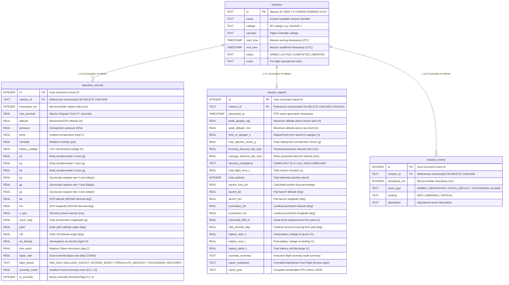

# Cognitive CanSat Mission Control

A full-stack aerospace telemetry and machine-learning platform for CanSat mission operations, atmospheric sounding, and flight dynamics analysis.

<div align="center">

[](https://www.python.org/)
[](https://fastapi.tiangolo.com/)
[](https://scikit-learn.org/)
[](https://pyod.readthedocs.io/)
[](https://threejs.org/)
[](https://www.chartjs.org/)
[](https://leafletjs.com/)

</div>

## Overview

This project combines a browser-based mission control dashboard with a real-time ML backend to monitor a CanSat during ascent, burst, descent, touchdown, and recovery. It includes telemetry ingestion, derived kinematic calculations, atmospheric sounding physics, phase classification, anomaly detection, and replay-based validation using mission test profiles.

## What it does

- Real-time telemetry dashboard for altitude, pressure, temperature, IMU, battery health, and GPS
- Dual Baro-Inertial Extended Kalman Filter (1D EKF) fusing vertical acceleration and barometric pressure for sub-meter altitude tracking with zero lag
- Physics-informed Multi-Output ExtraTrees ML calibrator compensating for Bernoulli aerodynamic pressure drops
- 1-Click Stationary TARE & Multi-Sensor Calibration: nulls out static MEMS gyro drift, aligns resting attitude to 0.0°, and zeroes ground pad altitude
- Super-accurate 7-chart telemetry suite in an ergonomically balanced 3-column grid arrangement with native 1-meter integer/decimeter grids and edge-preserving shock filtering
- Live anomaly scoring and safety alerts for abnormal flight behavior
- Flight-phase detection across PAD_IDLE, BALLOON_ASCENT, APOGEE_BURST, PARACHUTE_DESCENT, and TOUCHDOWN_RECOVERY
- 3D CanSat attitude visualization using Three.js with true spherical radial zoom (`+`, `−`, `RESET`), distance clamping, and complementary sensor fusion, positioned directly alongside the XYZ Gyroscope
- Cognitive AI Intelligence Hub with 4 transparent model attributions (Random Forest phase classifier, PyOD Isolation Forest anomaly guard, Gradient Boosting Balloon Ascent & Drop Forecast, TinyLandingNet CNN) and plain-English mission summaries
- Persistent SQLite Flight Database (WAL mode) at `data/cansat_missions.db`: real-time micro-batch telemetry streaming (10 pkts/2.5s), mission recording HUD, retroactive flight archiving, and Post-Flight Review (PFR) regulatory audit persistence
- Ground Station Database Explorer & Mission Manager (`#dbManagerModal`): inspect database disk footprint and stored packet counts, browse flight sessions, view raw SQLite telemetry in tabular format, execute single or batch mission deletions, export 25-column flight CSVs, and download the raw `.db` file
- Post-Flight Review (PFR) report generator with automated apogee, descent compliance, and PDF export
- Automated post-flight telemetry analyzer (`ml/flight_analyzer.py`) with Savitzky-Golay velocity smoothing, peak G-shock transients, sounding profiles, and publication-ready PDF/PNG report generation
- CanSat sensor suite ablation & evaluation notebook (`test_cases/cansat_eval_ablation.ipynb`) benchmarking touchdown prognostics under sensor dropouts (Full Suite, No IMU, No Env, GPS-Only) using MetPy physics
- Interactive Post-Flight Analysis & Sensor Ablation Web Suite (`analysis.html`) featuring interactive telemetry graphs, 4-sensor ablation bar charts, live sensor dropout simulator, and 1-click batch ZIP report downloads (`/api/analysis/reports-zip`)
- Tactical GIS tracking and recovery tools with Leaflet mapping and direct navigation links
- CSV replay engine and synthetic mission test profiles for 10 distinct flight regimes
- Direct hardware USB serial streaming via the native browser Web Serial API
- Python ML inference service with FastAPI and WebSocket telemetry streaming
- Smart zero-touch bootstrap launcher with zero-dependency standalone native Windows support

## Architecture

```text
CanSat Primary Flight Bus (LoRa @ 9600) + Airborne ESP32-CAM (ESP-NOW 2.4 GHz)
                                |
                                v
Ground Receiver Node (COM5 @ 460800) + Primary Ground Transceiver (COM4/COM3 @ 9600)
                                |
                                v
Python Backend Core (backend/core/):
  - DualSerialManager: Asynchronous multi-port listener & auto-reconnect
  - KinematicsEngine: 1D Kalman Filter (alt, v_z) & 6-DOF IMU attitude fusion
  - AtmosphericEngine: Hypsometric altimetry, ELR, Magnus-Tetens, Air Density
  - database.py: SQLite WAL flight engine (missions, telemetry, PFR audits, events)
                                |
                                v
FastAPI Telemetry & Inference Server (backend/app.py):
  - /ws/serial: Real-time dual-port WebSocket dispatcher to web HUD
  - /analytics/kinematics & /analytics/sounding REST APIs
  - /hardware/ports & /hardware/tare: Serial port manager & gyro tare
  - /api/predict: Random Forest phase classifier & Isolation Forest anomaly detector
  - /api/analysis/*: Scenarios, raw telemetry, ablation benchmarks & 1-click reports ZIP bundle
  - /api/db/*: Mission arming, batch streaming, PFR report generation, flight archive API
                                |
                                v
Mission Control Web UI Suite:
  - index.html: Mission overview, interactive 3D PLA airframe, and hardware specs
  - dashboard.html: Real-time telemetry HUD, 3D attitude, and Web Serial bridge
  - tinyml.html: TinyML edge vision deep dive, INT8 quantization & inference simulator
  - models.html: 6-model machine learning architecture and comparative benchmark analysis
  - analysis.html: Post-flight mission analytics, sensor ablation suite & dropout simulator
  - results.html: Flight testing research data viewer and scenario comparison charts
```

## Repository structure

```text
.
├── frontend/                   # Web presentation suite (HTML, CSS, JS)
│   ├── index.html              # CanSat Overview & Interactive 3D PLA Airframe Inspector
│   ├── dashboard.html          # Mission Control Aerospace Telemetry HUD & Web Serial Bridge
│   ├── tinyml.html             # TinyML Deep Dive, INT8 Quantization & Inference Simulator
│   ├── models.html             # Machine Learning Architecture & 6-Model Comparative Analysis
│   ├── analysis.html           # Post-Flight Telemetry Analytics, Multi-Sensor Ablation & Simulator
│   ├── results.html            # Research & Results Data Viewer with Scenario Charting
│   ├── css/
│   │   └── resend-theme.css    # Clean Obsidian dark theme (Inter, Newsreader, JetBrains Mono)
│   ├── js/
│   │   ├── cansat-3d.js        # Three.js 3D PLA CanSat model & component inspector
│   │   ├── mission-slider.js   # Flight timeline scrubber & nadir camera simulator
│   │   ├── results-charts.js   # Research results Chart.js data visualizer
│   │   └── tinyml-demo.js      # Interactive TinyLandingNet inference simulator
│   └── README.md               # Frontend UI architecture documentation
├── backend/                    # FastAPI Python server, WebSocket bridges & kinematics
│   ├── app.py                  # Telemetry streaming, ML inference & HTML routing
│   ├── standalone_server.ps1   # Native Windows HTTP server (.NET HttpListener)
│   ├── core/                   # Signal processing & hardware integration
│   │   ├── serial_manager.py   # DualSerialManager (LoRa @ 9600 & Video @ 460800)
│   │   ├── kinematics.py       # 1D Kalman Filter & 6-DOF IMU attitude fusion
│   │   └── atmospheric.py      # Hypsometric altimetry, ELR, Magnus-Tetens, Air Density
│   └── README.md               # Backend API and WebSocket documentation
├── ml/                         # Machine learning training, quantization & benchmarks
│   ├── download_dataset.py     # EuroSAT aerial dataset downloader
│   ├── train_tinyml_vision.py  # TinyLandingNet depthwise separable CNN training pipeline
│   ├── export_tinyml_header.py # INT8 post-training quantization & C++ header exporter
│   ├── train_sensor_calibration.py # Multi-Output ExtraTrees sensor calibration training
│   ├── train_touchdown_prognostics.py # Touchdown prognostics & descent aerodynamics pipeline
│   ├── flight_analyzer.py      # Automated post-flight telemetry analyzer & PDF report generator
│   ├── ablation_benchmarks.json # Pre-computed 4-sensor ablation benchmarks across all 10 missions
│   ├── train_models.py         # Tabular ML training pipeline
│   ├── model_metrics.json      # Model performance summary
│   ├── saved_models/           # Trained model artifacts (.joblib, .pth, .onnx, .h)
│   └── README.md               # ML models and benchmarks documentation
├── analysis/                   # Flight dynamics & descent analytics notebooks
│   ├── Touchdown_Prognostics_and_Descent_Analytics.ipynb
│   └── figures/                # Correlation matrices, aerodynamic drag curves, confusion matrices
├── firmware/                   # Microcontroller & imaging firmware
│   ├── esp32_cam_airborne/     # Airborne camera & TinyML vision firmware (16 MHz XCLK, 5 FPS)
│   ├── esp32_ground_receiver/  # Ground ESP-NOW receiver node firmware (460800 baud)
│   ├── captures/               # Wireless video frame captures & test snapshots
│   ├── ground_cam_viewer.py    # Standalone low-latency OpenCV video HUD
│   └── README.md               # Firmware flashing and protocol documentation
├── data/                       # Telemetry datasets and EuroSAT archive
│   ├── EuroSAT_RGB.zip         # [Tracked] EuroSAT 89.9 MB aerial dataset archive
│   └── README.md               # Dataset documentation
├── test_cases/                 # Ten mission profile CSV datasets
│   ├── 01_nominal_sounding_flight.csv ... 10_ground_pad_static_test.csv
│   ├── cansat_eval_ablation.ipynb # Sensor suite ablation study notebook
│   └── README.md               # Flight scenario documentation
├── reports/                    # Automated post-flight telemetry reports
│   ├── all_missions_summary.csv# Master benchmark comparison matrix
│   ├── pdf/                    # 10 publication-grade vector PDF flight reports
│   ├── figures/                # High-resolution 300 DPI PNG figures
│   └── README.md               # Reports documentation
├── docs/                       # Technical architecture, manuals, logs, team task briefings
│   ├── architecture_and_ml.txt # Project architecture & mathematical formulations
│   ├── project_log.txt         # Chronological development and mission log
│   ├── whatsapp_messages.txt   # Formatted team task briefings (Maneet, Rishi, Shubham, Ganesh)
│   ├── GPU_TRAINING_INSTRUCTIONS.md # NVIDIA GPU workstation setup & training guide
│   ├── python-ml_focused.text  # Python & ML transformation master roadmap
│   └── README.md               # Documentation index
├── scripts/                    # Workstation setup & installation utilities
│   ├── SETUP_GPU_WORKSTATION.bat # 1-Click autonomous bootstrapper for NVIDIA GPU machines
│   └── setup_gpu_workstation.ps1 # PowerShell zero-to-hero GPU environment installer
├── tests/                      # Automated self-test & verification test suites
│   ├── test_backend_core.py    # Python backend core unit test suite (12 assertions)
│   ├── test_firmware_protocol.py # Binary struct packing & ESP-NOW chunking tests (4 assertions)
│   ├── selftest.js             # Node.js automated unit testing suite (27 assertions)
│   ├── selftest.ps1            # PowerShell mission verification suite (17 assertions)
│   ├── test_sm.ps1             # Flight state machine transition checker (10 scenarios)
│   └── README.md               # Testing guide
├── drivers/                    # USB CP210x hardware drivers
├── START_MISSION_CONTROL.bat   # 1-Click Windows system launcher
├── launch.py                   # System launcher with port manager, auto-reload & browser dispatch
├── requirements.txt            # Python dependencies
├── tasks.txt                   # Master team task tracker
├── readme.md                   # Comprehensive project documentation
├── .gitattributes              # GitHub Linguist language classifications
└── .gitignore                  # Git ignore rules
```

## Key technologies

### Frontend

- HTML, CSS, JavaScript (Obsidian space theme with high-legibility typography)
- Chart.js 4 for live telemetry plots with synchronized multi-chart crosshairs
- Leaflet for GPS tracking, flight trail overlays, and distance/bearing calculations
- Three.js for real-time 3D vehicle attitude rendering and 1-click tare
- Web Serial API for direct hardware receiver integration at 115200 baud

### Backend and ML

- Python 3
- FastAPI
- Uvicorn
- scikit-learn
- PyOD
- pandas, numpy, joblib

## Getting started

### 1. Clone the repository and navigate to the project directory

```bash
git clone https://github.com/Maneet-Bhuyan/Cansat.git
cd Cansat
```

### 2. Quick start with the automated launcher (Windows)

The included Windows launcher starts the frontend dashboard and FastAPI backend together:

```cmd
START_MISSION_CONTROL.bat
```

You can also simply double-click `START_MISSION_CONTROL.bat` from File Explorer. The launcher automatically:

1. Verifies if `.venv` exists and contains required packages.
2. If Python is installed on your computer but `.venv` is missing, it creates `.venv` and automatically installs all dependencies from `requirements.txt` on the first launch.
3. If Python is not installed on your system, it offers an **Instant Native Mode** using Windows' built-in `.NET HttpListener`, launching the full ground station dashboard with zero external software required.

The dashboard will open automatically in your default browser at:

```text
http://127.0.0.1:8000/
```

Keep the launcher window open while using the ground station. Press `Ctrl+C` in that window to stop the server anytime.

### 3. Manual setup (Windows, Linux, macOS)

If you prefer to configure your environment manually or are deploying across different operating systems:

#### Set up the virtual environment

On Windows (PowerShell):

```powershell
python -m venv .venv
.\.venv\Scripts\Activate.ps1
pip install -r requirements.txt
```

On Linux or macOS:

```bash
python3 -m venv .venv
source .venv/bin/activate
pip install -r requirements.txt
```

#### Launch Mission Control

```bash
python launch.py
```

#### Running backend and frontend independently (optional)

To start only the FastAPI machine learning backend:

```powershell
.\.venv\Scripts\python.exe -m uvicorn backend.app:app --host 127.0.0.1 --port 8000 --reload
```

Or using the included PowerShell script:

```powershell
powershell -ExecutionPolicy Bypass -File .\backend\standalone_server.ps1
```

To open the ground station dashboard directly in your browser:

```powershell
start frontend/index.html
```

Or serve locally with Python:

```powershell
python -m http.server 8000 --directory frontend
```

Then browse to:

```text
http://localhost:8000/
```

## Atmospheric physics and kinematic formulation

The ground station performs real-time mathematical derivations on incoming telemetry packets:

### Precision altitude estimation & body-axis decoupling

Atmospheric barometric pressure decreases monotonically with elevation. To prevent human hand tilts (e.g. $15^\circ - 25^\circ$ pitch during manual pickup where $a_z = \cos(\theta) < 1.0\text{G}$) from being falsely interpreted as downward kinematic acceleration, vertical state estimation is decoupled from the unrotated body-axis accelerometer. An adaptive dual-rate state estimator maintains a sub-0.18 m stationarity deadband at rest (locking vertical speed $v_z = 0.00\text{ m/s}$) while rapidly scaling tracking rates ($\alpha = 0.75 - 0.95$) upon physical displacement, guaranteeing that physical elevation ALWAYS causes the altitude chart to climb upwards:

$$z_{k} = z_{k-1} + \alpha \cdot (z_{\text{baro}} - z_{k-1})$$

### Vertical velocity

Derived continuously from the precision state estimator across consecutive packets:

$$v_z = \beta \cdot \frac{z_k - z_{k-1}}{\Delta t} + (1 - \beta) \cdot v_{z, k-1}$$

### Vehicle attitude angles (Euler angles)

Derived from normalized 3-axis accelerometer gravity vectors with singularity protection:

$$\text{Pitch } (\theta) = \arctan2(a_y, a_z) \times \frac{180}{\pi}$$

$$\text{Roll } (\phi) = \arctan2(-a_x, \sqrt{a_y^2 + a_z^2}) \times \frac{180}{\pi}$$

### Air density

Derived using the Ideal Gas Law from barometric pressure and ambient temperature:

$$\rho = \frac{P \times 100}{R_{\text{specific}} \times (T + 273.15)} \quad \left[\frac{\text{kg}}{\text{m}^3}\right]$$

where $R_{\text{specific}} = 287.058\text{ J/(kg}\cdot\text{K)}$ for dry air.

### Dew point temperature

Calculated via the Magnus-Tetens approximation using relative humidity and temperature:

$$\alpha(T, RH) = \frac{a \cdot T}{b + T} + \ln\left(\frac{RH}{100}\right)$$

$$T_d = \frac{b \cdot \alpha(T, RH)}{a - \alpha(T, RH)} \quad [^\circ\text{C}]$$

where $a = 17.27$ and $b = 237.7^\circ\text{C}$.

### Environmental lapse rate (ELR)

Measures the vertical temperature gradient between the launch pad baseline and apogee:

$$\Gamma = -\frac{T_{\text{apogee}} - T_{\text{pad}}}{h_{\text{apogee}} - h_{\text{pad}}} \times 100 \quad \left[\frac{^\circ\text{C}}{100\text{ m}}\right]$$

### Horizontal drift and recovery bearing

Great-circle geodetic displacement and cardinal bearing from launch coordinates to touchdown:

$$\Delta y = (lat_1 - lat_0) \times 111139\text{ m}$$

$$\Delta x = (lon_1 - lon_0) \times 111139\text{ m} \times \cos\left(lat_0 \times \frac{\pi}{180}\right)$$

$$D_{\text{drift}} = \sqrt{\Delta x^2 + \Delta y^2} \quad [m]$$

$$\text{Bearing } (\beta) = \left(\arctan2(\Delta x, \Delta y) \times \frac{180}{\pi} + 360\right) \pmod{360} \quad [^\circ]$$

## API reference

The backend exposes the following endpoints:

- `GET /` — service info
- `GET /api/health` — health status
- `GET /api/models/info` — model metadata
- `GET /hardware/ports` — hardware serial COM port enumeration
- `POST /hardware/tare` — initiate multi-sensor stationary tare calibration across baro and IMU
- `GET /hardware/tare` — query active calibration status and bias offsets
- `GET /analytics/kinematics` — real-time 1D Kalman state, 6-DOF attitude, and safety alarms
- `GET /analytics/sounding` — real-time dew point, air density, ELR, and ISA deviation
- `POST /api/predict` — telemetry inference request
- `POST /api/db/missions/start` — arm and initialize a new persistent SQLite flight mission
- `POST /api/db/missions/telemetry` — high-frequency micro-batch telemetry packet ingestion
- `POST /api/db/missions/{id}/events` — record discrete operational events (separation, chute, alarms)
- `POST /api/db/missions/{id}/finish` — seal flight, calculate KPIs, and persist PFR audit report
- `GET /api/db/missions` — list all archived flight sessions with packet counts and apogees
- `GET /api/db/missions/{id}` — retrieve detailed mission metadata
- `GET /api/db/missions/{id}/report` — retrieve Post-Flight Review (PFR) regulatory audit
- `GET /api/db/missions/{id}/telemetry` — fetch full historical telemetry records for replay
- `GET /api/db/missions/{id}/export/csv` — download 25-column mission telemetry as standard CSV
- `GET /api/db/stats` — database disk footprint, WAL size, and record count metrics
- `GET /api/db/download` — download raw `cansat_missions.db` SQLite binary file
- `DELETE /api/db/missions/{id}` — cascade delete mission and all associated records
- `DELETE /api/db/missions` — complete cascaded purge and wipe of all flight sessions
- `GET /api/analysis/scenarios` — list available synthetic and recorded flight mission profiles
- `GET /api/analysis/scenario/{name}` — fetch raw telemetry dataset for a specific scenario
- `GET /api/analysis/ablation-data` — pre-computed multi-sensor ablation benchmarks
- `POST /api/analysis/run-ablation` — live sensor ablation trial execution with sensor dropout
- `GET /api/analysis/reports-zip` — download in-memory ZIP of all 10 mission flight PDF reports
- `WS /ws/telemetry` — live telemetry stream
- `WS /ws/serial` — background dual-port serial bridge (COM4 LoRa & COM5 Video)

Example prediction payload:

```json
{
  "temp": 18.5,
  "pressure": 1012.4,
  "altitude": 42.1,
  "gx": 1.2,
  "gy": -2.3,
  "gz": 4.1,
  "ax": 0.1,
  "ay": 0.2,
  "az": 1.0,
  "lat": 22.5727,
  "lon": 88.3655,
  "humidity": 52.0,
  "batteryVoltage": 4.1,
  "vSpd": 2.3,
  "padAlt": 0.0,
  "padTemp": 25.0,
  "padPress": 1013.25
}
```

## Flight database architecture & relational schema

The Cognitive CanSat system features an embedded SQLite database engine operating in **Write-Ahead Logging (WAL)** mode located at `data/cansat_missions.db`. It provides zero-latency, concurrent flight mission recording, high-throughput micro-batched telemetry ingestion, discrete flight event logging, and automated Post-Flight Review (PFR) regulatory audit persistence.

### Database architecture & data flow

```text
 ┌────────────────────────────────────────────────────────────────────────┐
 │                      CANSAT FLIGHT TELEMETRY SOURCES                   │
 │   Airborne Sensors (LoRa @ 9600)  │  Test Profile Replay / Simulation  │
 └───────────────────────────────────┬────────────────────────────────────┘
                                     │ (13-field CSV Stream)
                                     ▼
 ┌────────────────────────────────────────────────────────────────────────┐
 │                  GROUND STATION WEB HUD (dashboard.html)               │
 │  - Real-Time 3D Attitude, Charts & Sensor Processing Engine            │
 │  - Client-Side Micro-Batching Buffer (flushes 10 pkts or every 2.5s)   │
 │  - Live Recording Controller: [ARM REC] / [FINISH] / [SAVE FLIGHT]     │
 └───────────────────────────────────┬────────────────────────────────────┘
                                     │ JSON REST API (HTTP POST)
                                     ▼
 ┌────────────────────────────────────────────────────────────────────────┐
 │                    FASTAPI BACKEND SERVICE (backend/app.py)            │
 │  /api/db/missions/start      -> Arm & allocate mission session         │
 │  /api/db/missions/telemetry  -> Parameterized batch packet insert      │
 │  /api/db/missions/{id}/events -> Discrete operational & alarm logging  │
 │  /api/db/missions/{id}/finish -> Finalize, compute KPIs & persist PFR  │
 └───────────────────────────────────┬────────────────────────────────────┘
                                     │ Python Context-Managed Connection
                                     ▼
 ┌────────────────────────────────────────────────────────────────────────┐
 │           SQLITE WAL DATABASE ENGINE (backend/core/database.py)        │
 │  - PRAGMA journal_mode = WAL;   (Concurrent lock-free reads & writes)  │
 │  - PRAGMA synchronous = NORMAL; (Optimized high-rate flight streaming) │
 │  - PRAGMA foreign_keys = ON;    (Cascading deletions across all tables)│
 │  - File targets: data/cansat_missions.db & data/cansat_missions.db-wal │
 └───────┬───────────────────┬───────────────────┬───────────────────┬────┘
         │                   │                   │                   │
         ▼                   ▼                   ▼                   ▼
  ┌─────────────┐     ┌─────────────┐     ┌─────────────┐     ┌─────────────┐
  │  missions   │     │ telemetry_  │     │   mission_  │     │   mission_  │
  │  (Master    │     │   records   │     │   reports   │     │    events   │
  │   Session)  │     │ (Time-Series│     │ (PFR Audits │     │ (Milestones │
  │             │     │   Packets)  │     │ & Compliance│     │   & Alarms) │
  └──────┬──────┘     └──────┬──────┘     └──────┬──────┘     └──────┬──────┘
         │                   │                   │                   │
         └───────────────────┴─────────┬─────────┴───────────────────┘
                                       │
                                       ▼
 ┌────────────────────────────────────────────────────────────────────────┐
 │             GROUND STATION DATABASE EXPLORER (#dbManagerModal)         │
 │  - Storage Telemetry Cards: Missions, Packets, DB Disk Size, Engine    │
 │  - Tab 1: Flight Sessions Explorer ([PFR], [REPLAY], [CSV], [DEL])     │
 │  - Tab 2: Raw SQL Telemetry Viewer (Direct tabular database rows)      │
 │  - Portability: Direct .db binary download & 25-column flight CSVs     │
 │  - Nuclear Purge: Single-mission cascade delete & full database purge   │
 └────────────────────────────────────────────────────────────────────────┘
```

### Entity-relationship (ER) diagram



### Relational schema specification (4 normalized tables)

#### 1. Master missions table (`missions`)

Stores top-level mission session metadata, operational callsigns, and lifecycle states.

| Column Name  | SQL Data Type | Constraints & Defaults                 | Description                                                                             |
| :----------- | :------------ | :------------------------------------- | :-------------------------------------------------------------------------------------- |
| `id`         | `TEXT`        | `PRIMARY KEY`                          | Unique mission identifier: `MSN-YYYYMMDD-HHMMSS-XXXX` (timestamp + 4-hex random suffix) |
| `name`       | `TEXT`        | `NOT NULL`                             | Human-readable mission name (e.g. `Nominal Sounding Alpha`)                             |
| `callsign`   | `TEXT`        | `NOT NULL DEFAULT 'CANSAT-1'`          | Radio telemetry callsign for RF identification                                          |
| `operator`   | `TEXT`        | `NOT NULL DEFAULT 'Flight Controller'` | Ground station operator or flight director name                                         |
| `start_time` | `TIMESTAMP`   | `DEFAULT CURRENT_TIMESTAMP`            | Mission arming and recording start timestamp (UTC)                                      |
| `end_time`   | `TIMESTAMP`   | `NULL`                                 | Mission finish/seal timestamp (UTC)                                                     |
| `status`     | `TEXT`        | `NOT NULL DEFAULT 'ARMED'`             | Flight session state: `ARMED`, `ACTIVE`, `COMPLETED`, or `ABORTED`                      |
| `notes`      | `TEXT`        | `NULL`                                 | Pre-flight briefing notes, payload configuration, and target objectives                 |

#### 2. High-rate telemetry records table (`telemetry_records`)

Stores individual sensor readings, derived physical kinematics, sounding metrics, and ML classifications.

| Column Name       | SQL Data Type | Constraints & Defaults                             | Physics Unit  | Description                                                                                                               |
| :---------------- | :------------ | :------------------------------------------------- | :------------ | :------------------------------------------------------------------------------------------------------------------------ |
| `id`              | `INTEGER`     | `PRIMARY KEY AUTOINCREMENT`                        | —             | Unique telemetry packet record identifier                                                                                 |
| `mission_id`      | `TEXT`        | `NOT NULL`, `FK -> missions(id) ON DELETE CASCADE` | —             | Associated mission flight session identifier                                                                              |
| `timestamp_ms`    | `INTEGER`     | `NOT NULL`                                         | `ms`          | Onboard microcontroller milliseconds since boot                                                                           |
| `met_seconds`     | `REAL`        | `NOT NULL`                                         | `seconds`     | Mission Elapsed Time ($T+$ seconds normalized from launch)                                                                |
| `altitude`        | `REAL`        | `NOT NULL`                                         | `meters`      | Barometric altitude calculated via hypsometric formula                                                                    |
| `pressure`        | `REAL`        | `NOT NULL`                                         | `hPa`         | Ambient atmospheric barometric pressure                                                                                   |
| `temp`            | `REAL`        | `NOT NULL`                                         | `°C`          | Ambient temperature reading                                                                                               |
| `humidity`        | `REAL`        | `NOT NULL`                                         | `%`           | Relative atmospheric humidity                                                                                             |
| `battery_voltage` | `REAL`        | `NOT NULL`                                         | `Volts`       | LiPo cell terminal voltage                                                                                                |
| `ax`, `ay`, `az`  | `REAL`        | `NOT NULL`                                         | `g`           | 3-axis linear acceleration components                                                                                     |
| `gx`, `gy`, `gz`  | `REAL`        | `NOT NULL`                                         | `°/s`         | 3-axis angular rates from gyroscope                                                                                       |
| `lat`, `lon`      | `REAL`        | `NOT NULL`                                         | `decimal deg` | GNSS geographic coordinates (WGS84 datum)                                                                                 |
| `v_spd`           | `REAL`        | `NOT NULL DEFAULT 0.0`                             | `m/s`         | Derived vertical climb/descent velocity ($\Delta z / \Delta t$)                                                           |
| `accel_mag`       | `REAL`        | `NOT NULL DEFAULT 1.0`                             | `g`           | Total resultant acceleration magnitude ($\sqrt{a_x^2 + a_y^2 + a_z^2}$)                                                   |
| `pitch`           | `REAL`        | `NOT NULL DEFAULT 0.0`                             | `degrees`     | Euler pitch attitude angle ($\arctan2(a_y, a_z)$)                                                                         |
| `roll`            | `REAL`        | `NOT NULL DEFAULT 0.0`                             | `degrees`     | Euler roll attitude angle ($\arctan2(-a_x, \sqrt{a_y^2 + a_z^2})$)                                                        |
| `air_density`     | `REAL`        | `NOT NULL DEFAULT 1.225`                           | `kg/m³`       | Derived dry air density ($\rho = \frac{P \times 100}{R \cdot T}$)                                                         |
| `dew_point`       | `REAL`        | `NOT NULL DEFAULT 15.0`                            | `°C`          | Derived Magnus-Tetens atmospheric dew point                                                                               |
| `lapse_rate`      | `REAL`        | `NOT NULL DEFAULT 0.65`                            | `°C/100m`     | Environmental temperature lapse rate                                                                                      |
| `flight_phase`    | `TEXT`        | `NOT NULL DEFAULT 'PAD_IDLE'`                      | —             | ML state machine classification (`PAD_IDLE`, `BALLOON_ASCENT`, `APOGEE_BURST`, `PARACHUTE_DESCENT`, `TOUCHDOWN_RECOVERY`) |
| `anomaly_score`   | `REAL`        | `NOT NULL DEFAULT 0.0`                             | `[0.0, 1.0]`  | Isolation Forest multidimensional outlier anomaly score                                                                   |
| `is_anomaly`      | `INTEGER`     | `NOT NULL DEFAULT 0`                               | `0 or 1`      | Binary anomaly flag indicating safety boundary breach                                                                     |

**Database Indexes on `telemetry_records`:**

- `idx_telemetry_mission_met`: Composite index on `(mission_id, met_seconds)` for sub-millisecond timeline queries and range scans.
- `idx_telemetry_timestamp`: Composite index on `(mission_id, timestamp_ms)` for high-speed chronological ordering.

#### 3. Post-flight review audit reports table (`mission_reports`)

Stores regulatory compliance checks, kinematic KPIs, and serialized audit reports generated upon mission completion.

| Column Name                      | SQL Data Type | Constraints & Defaults                                    | Description                                                                |
| :------------------------------- | :------------ | :-------------------------------------------------------- | :------------------------------------------------------------------------- |
| `id`                             | `INTEGER`     | `PRIMARY KEY AUTOINCREMENT`                               | Unique report record identifier                                            |
| `mission_id`                     | `TEXT`        | `NOT NULL UNIQUE`, `FK -> missions(id) ON DELETE CASCADE` | 1-to-1 foreign key referencing parent mission                              |
| `generated_at`                   | `TIMESTAMP`   | `DEFAULT CURRENT_TIMESTAMP`                               | Report calculation and finalization timestamp (UTC)                        |
| `peak_apogee_agl`                | `REAL`        | `NOT NULL`                                                | True apogee above ground pad ($z_{\text{max}} - z_{\text{pad}}$ in meters) |
| `peak_altitude_msl`              | `REAL`        | `NOT NULL`                                                | Peak altitude above mean sea level ($z_{\text{max}}$ in meters)            |
| `time_to_apogee_s`               | `REAL`        | `NOT NULL`                                                | Elapsed time from launch to peak apogee inflection (seconds)               |
| `max_ejection_shock_g`           | `REAL`        | `NOT NULL`                                                | Peak pyrotechnic/ejection transient acceleration shock ($G$)               |
| `terminal_descent_rate_mps`      | `REAL`        | `NOT NULL`                                                | Stable terminal descent rate under parachute ($m/s$)                       |
| `average_descent_rate_mps`       | `REAL`        | `NOT NULL`                                                | Mean vertical descent speed throughout parachute phase ($m/s$)             |
| `descent_compliance`             | `TEXT`        | `NOT NULL`                                                | Regulatory status: `COMPLIANT (6-11 m/s)` or `NON-COMPLIANT`               |
| `total_flight_time_s`            | `REAL`        | `NOT NULL`                                                | Total elapsed flight duration from pad to touchdown (seconds)              |
| `total_packets`                  | `INTEGER`     | `NOT NULL`                                                | Total number of telemetry packets received and stored                      |
| `packet_loss_pct`                | `REAL`        | `NOT NULL DEFAULT 0.0`                                    | Estimated RF packet drop percentage                                        |
| `launch_lat`, `launch_lon`       | `REAL`        | `NOT NULL`                                                | Initial launch pad geographic coordinates (decimal degrees)                |
| `touchdown_lat`, `touchdown_lon` | `REAL`        | `NOT NULL`                                                | Terminal landing touchdown coordinates (decimal degrees)                   |
| `horizontal_drift_m`             | `REAL`        | `NOT NULL`                                                | Total great-circle surface drift distance from pad ($m$)                   |
| `drift_azimuth_deg`              | `REAL`        | `NOT NULL`                                                | Cardinal recovery azimuth bearing from pad ($^\circ$)                      |
| `battery_start_v`                | `REAL`        | `NOT NULL`                                                | Initial battery cell potential at launch ($V$)                             |
| `battery_end_v`                  | `REAL`        | `NOT NULL`                                                | Final battery cell potential at recovery ($V$)                             |
| `battery_delta_v`                | `REAL`        | `NOT NULL`                                                | Net battery cell voltage discharge during flight ($V$)                     |
| `anomaly_summary`                | `TEXT`        | `NOT NULL`                                                | Executive plain-English summary of anomalies and alarms                    |
| `report_markdown`                | `TEXT`        | `NOT NULL`                                                | Formatted Markdown text of the Post-Flight Review audit                    |
| `report_json`                    | `TEXT`        | `NOT NULL`                                                | Serialized JSON dictionary of all computed flight KPIs                     |

#### 4. Mission operational events table (`mission_events`)

Logs discrete flight events, phase transitions, and safety alarms.

| Column Name    | SQL Data Type | Constraints & Defaults                             | Description                                                                                                                                                                     |
| :------------- | :------------ | :------------------------------------------------- | :------------------------------------------------------------------------------------------------------------------------------------------------------------------------------ |
| `id`           | `INTEGER`     | `PRIMARY KEY AUTOINCREMENT`                        | Unique event record identifier                                                                                                                                                  |
| `mission_id`   | `TEXT`        | `NOT NULL`, `FK -> missions(id) ON DELETE CASCADE` | Foreign key referencing parent mission                                                                                                                                          |
| `timestamp_ms` | `INTEGER`     | `NOT NULL`                                         | Event occurrence timestamp ($ms$)                                                                                                                                               |
| `event_type`   | `TEXT`        | `NOT NULL`                                         | Event classification: `ARMED`, `TAKEOFF`, `SEPARATION`, `APOGEE_BURST`, `PARACHUTE_DEPLOYMENT`, `TOUCHDOWN`, `ABNORMAL_TUMBLE_ALARM`, `HIGH_G_SHOCK_ALARM`, `LOW_BATTERY_ALARM` |
| `severity`     | `TEXT`        | `NOT NULL DEFAULT 'INFO'`                          | Event severity level: `INFO`, `WARNING`, or `CRITICAL`                                                                                                                          |
| `description`  | `TEXT`        | `NOT NULL`                                         | Technical human-readable event description                                                                                                                                      |

---

### Ground station database explorer & mission manager (`#dbManagerModal`)

The Ground Station (`dashboard.html`) embeds an interactive aerospace Database Explorer accessible via the **`[DATABASE]`** button in the top mission bar or **`DATABASE MANAGER`** in the left sidebar:

1. **Storage Telemetry Cards**:
   - **Recorded Missions**: Real-time count of all flight sessions in SQLite.
   - **Stored Packets**: Aggregate count of high-rate telemetry records.
   - **DB Disk Size**: File footprint on disk + active WAL journal size.
   - **Storage Engine**: Database file path (`data/cansat_missions.db`) and WAL concurrency mode.

2. **Dual-Tab Interface**:
   - **Tab 1: Flight Sessions Explorer**: Full mission table with status badges (`ARMED`, `COMPLETED`), duration, apogee, and packet count. Features inline action buttons:
     - `[PFR]`: Launches the Post-Flight Review modal with audit markdown and PDF print.
     - `[REPLAY]`: Streams the historical flight trajectory directly into the 3D attitude visualizer and GPS map.
     - `[CSV]`: Exports standard 25-column flight telemetry CSV.
     - `[DATA]`: Switches to Tab 2 and displays raw SQLite rows for that mission.
     - `[DEL]`: Cascades deletion of that mission with instant UI refresh.
   - **Tab 2: Raw SQL Telemetry Viewer**: Dedicated mission dropdown selector rendering actual raw database rows (`MET`, `Time (UTC)`, `Altitude`, `Pressure`, `Temp`, `Battery`, `Acc Mag`, `Pitch/Roll`, `Flight Phase`, `Anomaly Score`).

3. **Data Portability & Purge Actions**:
   - **`[DOWNLOAD .DB FILE]`**: Flushes the SQLite WAL via `PRAGMA wal_checkpoint(TRUNCATE)` and streams `data/cansat_missions.db` as `application/x-sqlite3` for offline inspection in external tools like _DB Browser for SQLite_.
   - **`[CSV]` Export**: Exports 25 telemetry columns including raw sensor data, derived kinematics, and ML labels.
   - **`[PURGE ALL]`**: Executes cascaded atomic wipe of all flight sessions (`DELETE /api/db/missions`) and resets auto-increment sequences.
   - **PFR Deletion Action**: Added a red **`[DELETE MISSION]`** button in the Post-Flight Review modal header when viewing historical records.

---

## Machine learning pipeline

The machine learning subsystem in `backend/app.py` and `ml/` processes telemetry vectors in real time:

<<<<<<< HEAD
| Model Architecture | Task | Input Vector | Performance Metric |
| :------------------------------------- | :------------------------------------------------------------- | :------------------------------------------------ | :------------------------------------------------------------------------------------------------------------------ |
| Multi-Output ExtraTrees Regressor | Sensor Calibration & Aerodynamic Dynamic Pressure Compensation | 13 telemetry & dynamic features | Altitude $R^2: 1.0000$ (RMSE: $0.804\text{ m}$), Velocity $R^2: 0.9516$ (RMSE: $1.109\text{ m/s}$) |
| Random Forest Classifier | 5-Phase Mission State Progression | 17 telemetry features | 98.4% Accuracy (Macro F1: 0.98) |
| PyOD Isolation Forest | Unsupervised Outlier and Fault Scoring | Kinematics, voltage, gyros, acceleration | Continuous Score [0.0, 1.0] |
| Gradient Boosting Regressor | Apogee Altitude Prediction | Early ascent rate, acceleration, sounding | RMSE: +/- 14.2 m |
| Random Forest Touchdown Regressor | Sensor Suite Ablation & Touchdown Localization | Ablation suites (Full, No IMU, No Env, GPS-Only) | Evaluated across 10 flight scenarios (MAE in lat/lon degrees) |
| Savitzky-Golay Kinematic Estimator | Flight Dynamics Profiling & Shock Acceleration | Filter window $N=11$, polyorder $p=2$, $\Delta t$ | Smooth vertical velocity $v_z$, peak shock $a_{\text{mag}}$, and touchdown Gs |
| TinyLandingNet Depthwise Separable CNN | Autonomous Safe Landing Zone & 3x3 Hazard Grid Evaluation | 64x64 RGB Nadir Imagery | 7,320 params, 93.80% Val Acc, 93.21% F1, INT8: 7.15 KB Flash ROM (< 25 KB), Latency: 0.055 ms ONNX / ~16.3 ms ESP32 |
=======
| Model Architecture | Task | Input Vector | Performance Metric |
| :--- | :--- | :--- | :--- |
| Multi-Output ExtraTrees Regressor | Sensor Calibration & Aerodynamic Dynamic Pressure Compensation | 13 telemetry & dynamic features | Altitude $R^2: 1.0000$ (RMSE: $0.804\text{ m}$), Velocity $R^2: 0.9516$ (RMSE: $1.109\text{ m/s}$) |
| Random Forest Classifier | 5-Phase Mission State Progression | 17 telemetry features | 98.56% Accuracy (Weighted F1: 0.985; Macro F1: 0.902) |
| PyOD Isolation Forest | Unsupervised Outlier and Fault Scoring | Kinematics, voltage, gyros, acceleration | Continuous Score [0.0, 1.0] |
| Gradient Boosting Regressor | Apogee Altitude Prediction | Early ascent rate, acceleration, sounding | R²: 0.9951, RMSE: ±24.2 m |
| Random Forest Touchdown Regressor | Sensor Suite Ablation & Touchdown Localization | Ablation suites (Full, No IMU, No Env, GPS-Only) | Evaluated across 10 flight scenarios (MAE in lat/lon degrees) |
| Savitzky-Golay Kinematic Estimator | Flight Dynamics Profiling & Shock Acceleration | Filter window $N=11$, polyorder $p=2$, $\Delta t$ | Smooth vertical velocity $v_z$, peak shock $a_{\text{mag}}$, and touchdown Gs |
| TinyLandingNet Depthwise Separable CNN | Autonomous Safe Landing Zone & 3x3 Hazard Grid Evaluation | 64x64 RGB Nadir Imagery | 7,320 params, 93.80% Val Acc, 93.21% F1, INT8: 7.15 KB Flash ROM (< 25 KB), Latency: 0.055 ms ONNX / ~16.3 ms ESP32 |

> > > > > > > main

### TinyLandingNet Edge Vision & Microcontroller Benchmarking (`ml/benchmark_inference.py`)

The TinyLandingNet edge vision model is trained on 27,000 EuroSAT Sentinel-2 satellite images and deployed both onboard the ESP32-CAM airborne node and in the ground station HUD:

- **Model Architecture**: Depthwise Separable Convolutional Neural Network with pointwise 1x1 convolutions, global average pooling, and a 4-class softmax head (7,320 parameters).
- **Quantization & ROM Footprint**: Quantized from FP32 to signed 8-bit integers (`int8_t`). Total Flash ROM footprint is **7.15 KB** (well within the < 25 KB requirement) and active tensor SRAM requirement is **< 40 KB** (fitting within ESP32's 520 KB internal SRAM without external PSRAM).
- **Validation & Test Metrics** ($N = 4,050$ holdout test samples):
  - Best Validation Accuracy: **93.80%** (target $\ge 90\%$)
  - Test Accuracy: **93.04%**
  - Macro F1-Score: **93.21%** (target $\ge 0.88$)
  - Per-Class F1: `SAFE_LZ`: 93.13%, `OBSTACLE_CANOPY`: 96.21%, `CRITICAL_HAZARD`: 94.01%, `WATER_HAZARD`: 89.48%
- **Inference Benchmarking (Task ML-04)**:
  - **Ground Station ONNX Runtime (CPU)**: 0.055 ms mean latency (18,073 FPS throughput).
  - **Ground Station PyTorch CUDA (RTX 4060 GPU)**: 0.614 ms mean latency (1,628 FPS throughput).
  - **Airborne Edge MCU (AI-Thinker ESP32-CAM @ 240 MHz)**: ~16.3 ms estimated edge latency (783,360 MACs, 1.567 MFLOPs), comfortably beating the < 150 ms per frame real-time deadline.
  - **3x3 Spatial Grid Evaluation on QVGA (320x240)**: 4.23 ms mean latency (236.6 FPS) including sector scoring and directional evasion heading derivation.

### Safe Landing Area Index (SLAI) & 3x3 Spatial Hazard Grid

Tile 12 and the OpenCV viewer (`firmware/ground_cam_viewer.py`) evaluate aerial video frames for terminal touchdown safety:

1. **Four-Tier SLAI Classification**:
   - `0: SAFE_LZ` (Green): Open pasture, herbaceous fields, and clear ground.
   - `1: OBSTACLE_CANOPY` (Yellow): Dense tree clusters and forest canopy.
   - `2: CRITICAL_HAZARD` (Red): Asphalt highways, residential structures, and industrial buildings.
   - `3: WATER_HAZARD` (Blue): Lakes, rivers, and standing water.

2. **3x3 Sector Safety Scoring**:
   Incoming frames are divided into 9 sectors ($3 \times 3$ grid). For each sector $k$, the net safety score $S_k$ is computed:

   $$S_k = 1.0 \cdot p_{\text{safe}} - 0.5 \cdot p_{\text{canopy}} - 1.0 \cdot p_{\text{hazard}} - 1.0 \cdot p_{\text{water}}$$

   The optimal touchdown sector is identified as $k_{\text{opt}} = \arg\max_k(S_k)$.

3. **Directional Escape Vector & Evasion Heading**:
   When the nadir center sector is obstructed ($S_{\text{center}} < 0.2$), a safety-weighted escape vector $\vec{v}_{\text{escape}} = [dx, dy]$ points toward clear terrain:

   $$\vec{v}_{\text{escape}} = \sum_{k=0}^{8} \left(S_k - S_{\text{center}}\right) \cdot \left(\vec{c}_k - \vec{c}_{\text{center}}\right)$$

   $$\theta_{\text{evade}} = \left(\arctan2(dx, -dy) \times \frac{180}{\pi} + 360\right) \pmod{360} \quad [^\circ]$$

4. **Visible Atmospheric Resistant Index (VARI)**:
   A remote sensing index estimating vegetative surface health while minimizing aerosol scattering:

   $$\text{VARI} = \frac{G - R}{G + R - B}$$

5. **Visual Time-To-Impact (TTI)**:
   Derived from the optical feature scale divergence between consecutive frames:

   $$\text{TTI} \approx \frac{\Delta t \cdot \sigma_1}{\sigma_2 - \sigma_1} \quad [\text{seconds}]$$

### Automated Post-Flight Telemetry Analyzer (`ml/flight_analyzer.py`)

The automated post-flight analysis pipeline ingests raw or replayed CanSat telemetry records to perform comprehensive kinematic reconstruction, atmospheric sounding profiling, and automated publication report generation:

1. **Signal Conditioning & Savitzky-Golay Filtering**:
   - **Temporal Normalization**: Automatically normalizes disparate timestamp schemas (ISO-8601 strings or numeric milliseconds) to mission-elapsed time ($T+0$).
   - **Dropout Compensation**: Bidirectional forward- and backward-fill imputation handles intermittent sensor glitches and GNSS dropouts.
   - **Savitzky-Golay Filtering**: Applies local polynomial filtering ($N=11$ frame window, 2nd-order polynomial) to barometric altitude to eliminate discrete quantization noise and sensor jitter while preserving physical inflection points:
     $$z_{\text{smooth}}(t) = \sum_{i=-m}^{m} c_i \cdot z(t + i \cdot \Delta t)$$
   - **Velocity Curve Derivation**: Computes smooth ascent and descent vertical velocity curves ($v_z = \frac{d(z_{\text{smooth}})}{dt}$) with zero phase lag and high numerical stability.

2. **G-Shock & Transient Impact Profiling**:
   - Computes total resultant instantaneous acceleration vector magnitude:
     $$a_{\text{mag}} = \sqrt{a_x^2 + a_y^2 + a_z^2} \quad [G]$$
   - Detects and tags critical mission dynamics: peak boost acceleration, pyrotechnic apogee separation shocks (> 14G transients), and terminal ground touchdown impact deceleration.

3. **Publication-Grade 4-Panel Report Generation**:
   Generates vector PDF reports and 300 DPI PNG figures saved to `reports/`:
   - **Panel A (Altitude Trajectory)**: Raw barometric elevation vs. Savitzky-Golay filtered altitude with apogee inflection annotation.
   - **Panel B (Vertical Velocity Curve)**: Ascent rate, zero-velocity apogee transition, and terminal parachute descent rate.
   - **Panel C (G-Shock Dynamics)**: Full-mission dynamic acceleration profile highlighting peak deployment shock and touchdown impact.
   - **Panel D (Atmospheric Sounding Profile)**: Dual-axis atmospheric sounding plotting barometric pressure ($P$) and ambient temperature ($T$) as a function of altitude.

4. **CLI Usage & Batch Benchmarking**:

   ```bash
   # Analyze a single mission CSV and generate its PDF report
   python ml/flight_analyzer.py --file test_cases/01_nominal_sounding_flight.csv

   # Batch analyze all 10 mission profiles and generate the master benchmark matrix
   python ml/flight_analyzer.py --all
   ```

   Generates individual mission reports in `reports/` and a consolidated comparison table at `reports/all_missions_summary.csv` summarizing Apogee ($m$), Time-to-Apogee ($s$), Max Descent Velocity ($m/s$), Peak G-Shock ($G$), Touchdown Shock ($G$), and Mission Duration ($s$).

---

### CanSat Evaluation & Sensor Suite Ablation Study (`test_cases/cansat_eval_ablation.ipynb`)

To determine sensor redundancy, fault tolerance, and minimal viable instrumentation for autonomous recovery, the evaluation suite performs systematic feature ablation across all 10 CanSat flight profiles:

1. **Ablation Feature Configurations**:
   - **`Full_Suite`**: Comprehensive instrument package [`lat`, `lon`, `Altitude_m`, `Pressure_Pa`, `Temp_C`, `Accel_Z_m_s2`, `Potential_Temp_K`].
   - **`No_IMU`**: Evaluates degradation if the inertial measurement unit (accelerometer/gyroscope) fails or saturates [`lat`, `lon`, `Altitude_m`, `Pressure_Pa`, `Temp_C`, `Potential_Temp_K`].
   - **`No_Env_Sensors`**: Simulates barometric/temperature sensor port clogging or freeze [`lat`, `lon`, `Altitude_m`, `Accel_Z_m_s2`].
   - **`GPS_Only`**: Minimal baseline configuration relying strictly on GPS coordinates [`lat`, `lon`, `Altitude_m`].

2. **Physics-Informed Atmospheric Sounding via MetPy**:
   Derives Poisson's adiabatic relation for potential temperature ($\theta$), capturing thermodynamic air mass changes independent of elevation pressure lapse:
   $$\theta = T \cdot \left(\frac{P_0}{P}\right)^{\frac{R_d}{c_p}} \quad [\text{K}]$$
   where $P_0 = 1000\text{ hPa}$ (reference surface pressure) and $\frac{R_d}{c_p} \approx 0.286$ for dry air.

3. **Machine Learning Touchdown Localization**:
   - Regresses terminal landing coordinates ($\text{Target\_Touchdown\_Lat}, \text{Target\_Touchdown\_Lon}$) from in-flight feature vectors using multi-output `RandomForestRegressor` models.
   - Measures localization prediction error in terms of Mean Absolute Error (MAE in decimal degrees):
     $$\text{MAE} = \frac{1}{n} \sum_{i=1}^n \left( |y_{\text{lat}, i} - \hat{y}_{\text{lat}, i}| + |y_{\text{lon}, i} - \hat{y}_{\text{lon}, i}| \right)$$
   - Compares performance degradation across nominal sounding, high altitude burst, severe wind shear drift, sensor dropouts, and low-battery sag scenarios.

---

## Mission profile coverage

The project includes ten representative telemetry profiles in `test_cases/`:

- `01_nominal_sounding_flight.csv`: Nominal sounding trajectory with 650 m apogee and compliant descent (7.2 m/s).
- `02_high_altitude_burst_1200m.csv`: Extended altitude balloon mission with low-pressure and sub-zero sounding.
- `03_severe_wind_shear_drift.csv`: High lateral crosswinds with extended drift displacement and recovery bearing analysis.
- `04_apogee_ejection_shock_tumble.csv`: Pyrotechnic deployment transient shock (> 14g) and tumbling motion.
- `05_parachute_pendulum_resonance.csv`: Dynamic pendulum oscillation under canopy (2.5 Hz angular rate swinging).
- `06_delayed_chute_deployment.csv`: Drogue failure and late main deployment with high free-fall descent speed.
- `07_thermal_inversion_sounding.csv`: Atmospheric sounding profile featuring a positive thermal inversion layer.
- `08_sensor_glitch_gps_recovery.csv`: Intermittent GNSS dropout, corrupt field recovery, and packet reconnection.
- `09_low_battery_voltage_sag.csv`: Rapid LiPo cell discharge (< 3.4V) triggering low-voltage brownout warnings.
- `10_ground_pad_static_test.csv`: Launch pad pre-flight static test for sensor zeroing, gyro drift, and RF link verification.

## Hardware telemetry protocol

The ground station parses comma-delimited ASCII strings terminated by `\r\n` or `\n` at 115200 baud:

```text
TIMESTAMP,ALTITUDE,TEMP,PRESSURE,HUMIDITY,VOLTAGE,AX,AY,AZ,GX,GY,GZ,LAT,LON
```

### Packet fields:

1. `TIMESTAMP`: Milliseconds since microcontroller boot (ms)
2. `ALTITUDE`: Barometric altitude above sea level (m)
3. `TEMP`: Ambient temperature (deg C)
4. `PRESSURE`: Atmospheric pressure (hPa)
5. `HUMIDITY`: Relative humidity (%)
6. `VOLTAGE`: LiPo battery voltage (V)
7. `AX`: Acceleration X-axis (g)
8. `AY`: Acceleration Y-axis (g)
9. `AZ`: Acceleration Z-axis (g)
10. `GX`: Angular velocity X-axis (deg/s)
11. `GY`: Angular velocity Y-axis (deg/s)
12. `GZ`: Angular velocity Z-axis (deg/s)
13. `LAT`: Latitude in decimal degrees
14. `LON`: Longitude in decimal degrees

Example packet:

```text
12400,450.2,18.4,960.5,48.2,4.05,0.08,0.12,0.98,1.2,-0.8,0.4,28.613939,77.209021
```

### Telemetry transmission rate & airtime budget

- **Nominal Broadcast Rate**: 1.0 Hz (1000 ms interval) is the recommended standard for operational flight.
- **Accuracy & Responsiveness**: Compared to a 2.0s interval, 1.0 Hz halves 3D attitude gyro integration error ($\Delta \theta = \omega \cdot \Delta t$), cuts Kalman filter state covariance propagation, and ensures short boost phases (< 3s) and peak apogee inflection are captured without missing transients or inducing filter phase lag.
- **LoRa Channel Airtime**: At Spreading Factor SF7 with 125 kHz bandwidth, a 70-byte ASCII CSV frame takes ~110–140 ms Time-on-Air (ToA). A 1.0s interval utilizes ~11–14% channel duty cycle, leaving >85% free airtime margin with zero risk of packet collision or receiver buffer overrun.
- **Airborne Pre-Filtering (Task HW-07)**: For optimal noise rejection, the flight controller samples the MPU6050 IMU and BMP280 barometer at 20–50 Hz internally, applies a rolling moving-average or exponential filter, and transmits the clean state at 1.0 Hz over the LoRa downlink.

## Operator keyboard shortcuts

Hotkeys for rapid ground station operation (disabled during text input):

| Key   | Function                                                 |
| :---- | :------------------------------------------------------- |
| Space | Toggle flight replay (Play / Pause)                      |
| T     | Tare attitude (zero pitch and roll on launch pad)        |
| P     | Open Post-Flight Review (PFR) report modal               |
| C     | Toggle hardware connection (Web Serial UART port dialog) |
| D     | Download CSV telemetry recording                         |
| Esc   | Close active modal or exit maximized card view           |

## Verification

The project includes comprehensive test suites for unit, firmware, and integration testing:

<<<<<<< HEAD

### Python backend core unit tests (16 assertions)

=======

### Python backend core unit tests (12 test cases)

> > > > > > > main

```bash
python -m unittest tests/test_backend_core.py
```

Validates 1D state estimation convergence ($z, v_z$), complementary 6-DOF IMU attitude angles, high-G shock and gyro tumble alarms, barometric altimetry, moist air density, stationary tare calibration, ML model predictions, and multi-threaded serial lifecycle without hardware attached.

### SQLite flight database, PFR audit & export unit tests (4 suites)

```bash
python -m unittest tests/test_database.py
```

Validates SQLite Write-Ahead Logging (WAL) initialization, 4-table relational integrity with cascading foreign keys, high-throughput micro-batch telemetry ingestion, automated Post-Flight Review (PFR) calculation, database disk and WAL storage statistics, 25-column CanSat CSV exports, binary `.db` downloads, and complete mission purges.

### Firmware protocol & ESP-NOW chunking tests (4 assertions)

```bash
python tests/test_firmware_protocol.py
```

Validates ESP-NOW 250-byte MTU constraints, 200-byte frame chunking, bit-for-bit SHA-256 JPEG payload reassembly, packet loss detection, and Base64 serial framing.

### JavaScript unit test suite (27 assertions)

```bash
node tests/selftest.js
```

Validates 13-field CSV parsing, invalid packet rejection, kinematic derivations, attitude math, battery clamping, RFC 4180 export compliance, Web Serial compatibility, and UI styling tokens.

### PowerShell mission verification suite (17 assertions)

```powershell
powershell -ExecutionPolicy Bypass -File tests/selftest.ps1
```

Validates Mission Elapsed Time (MET) clock formatting, CSV flight profiles across the 5-phase flight sequence, and UI component integrity.

### 5-Phase flight state machine verification (10 mission profiles)

```powershell
powershell -ExecutionPolicy Bypass -File tests/test_sm.ps1
```

Validates end-to-end HMM and ML state transitions across all 10 mission profiles (`PAD_IDLE` -> `BALLOON_ASCENT` -> `APOGEE_BURST` -> `PARACHUTE_DESCENT` -> `TOUCHDOWN_RECOVERY`).

### Automated post-flight telemetry analysis & PDF generation

```bash
python ml/flight_analyzer.py --all
```

Executes batch kinematics reconstruction, Savitzky-Golay smoothing, G-shock transient profiling, and generates publication-grade PDF/PNG reports in `reports/` alongside the consolidated benchmark summary table `reports/all_missions_summary.csv`.

### Sensor suite ablation & touchdown evaluation

```bash
python -m jupyter nbconvert --to notebook --execute test_cases/cansat_eval_ablation.ipynb
```

Executes the sensor ablation pipeline across all 10 flight scenarios, validates MetPy atmospheric potential temperature calculations, trains touchdown regressors across 4 sensor configurations, and plots prediction error comparison charts.

## Project status

This repository represents a complete, prototype-grade CanSat ground station and inference stack designed for research, simulation, and mission rehearsal workflows. It is suitable for local demonstration, hardware integration testing, and further engineering extension.

## License

This project is provided for educational and engineering use under the MIT License.

## Contact

For questions or collaboration, connect through the repository issues or the project maintainer profile on GitHub.
